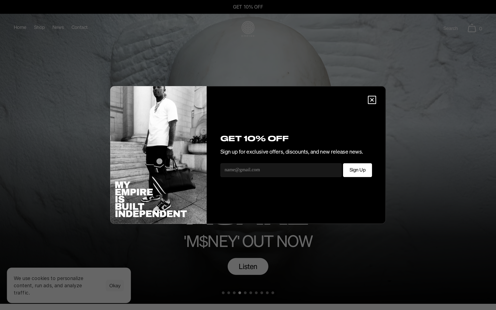
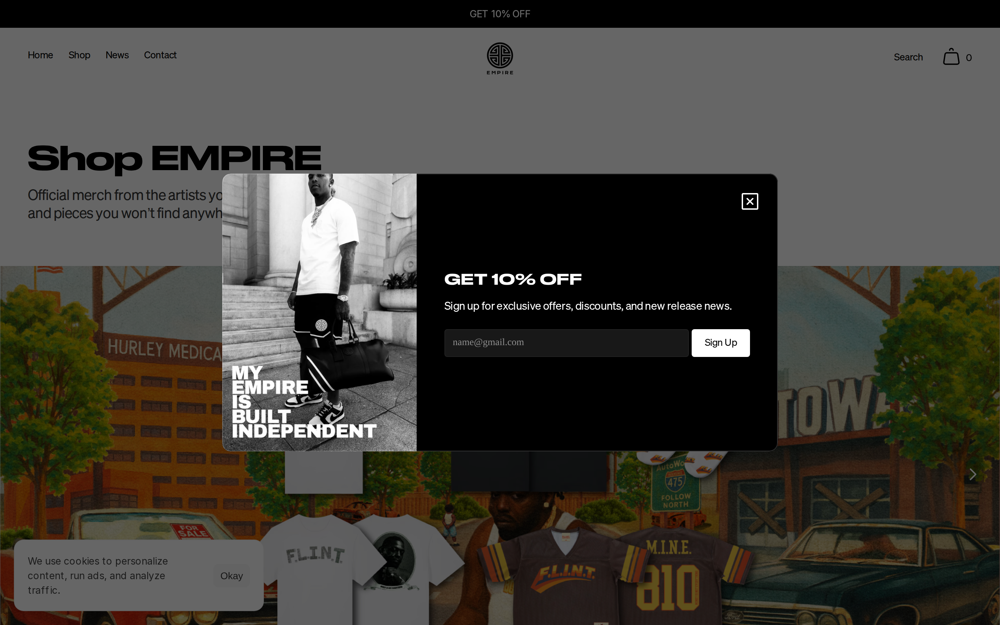
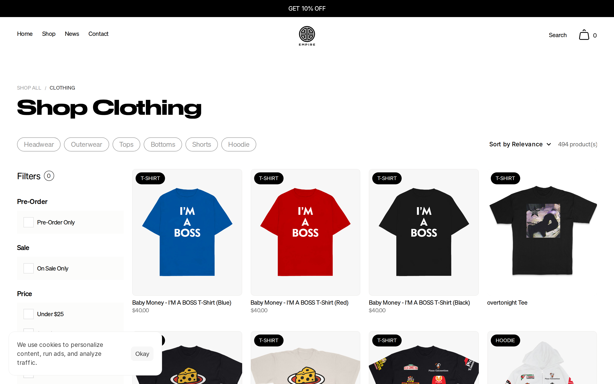
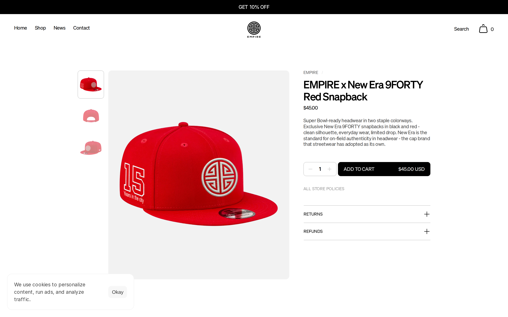
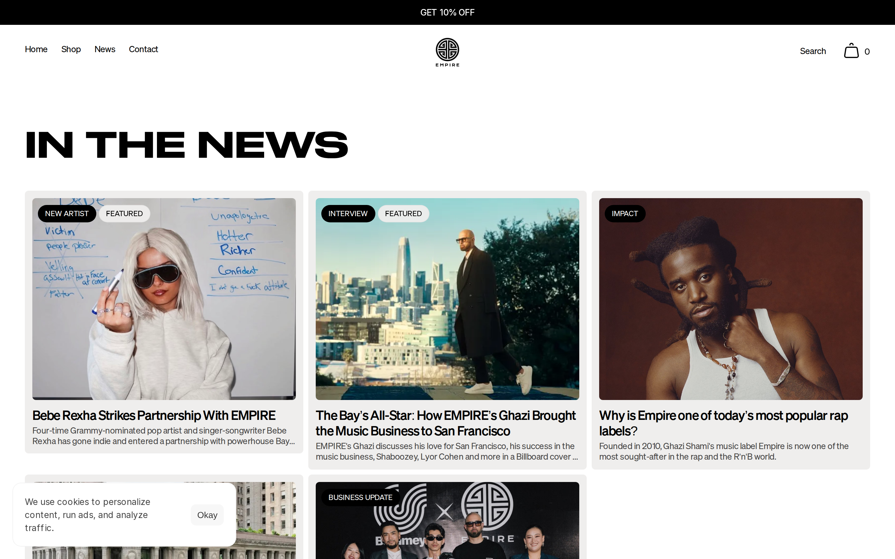
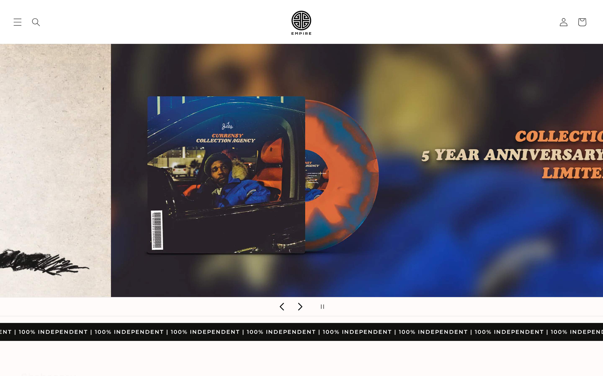

# Empire (empi.re) — Page Index

Screenshots live in [`../screenshots/empire/`](../screenshots/empire/).

---

## Home (`/`)

| # | Component | Screenshot ref | Key specs |
|---|---|---|---|
| 1 | Black announcement bar | `home/viewport-top.png` top strip | `#000` bg, white text, ~32px tall, centered "GET 10% OFF" |
| 2 | Transparent nav overlay | `home/viewport-top.png` | Left: Home/Shop/News/Contact · Center: circular logo · Right: Search + bag |
| 3 | Full-bleed hero carousel | `home/scroll-0.png`, `scroll-900.png` | 100vw portrait photo, artist name in Druk 72px uppercase white, subtitle in Test Söhne 47px |
| 4 | Pill CTA on hero | `home/scroll-900.png` | Rounded-full light button ("Listen") centered below title |
| 5 | Marquee ticker | `home/scroll-1800.png` (also on store) | `\| 100% INDEPENDENT \|` white on black, Druk font, infinite scroll |
| 6 | Section heading row | `home/scroll-1800.png` | HUGE left Druk heading ("SHOP") + black pill CTA right ("All Products") |
| 7 | Product card | `home/scroll-1800.png` | `#f5f5f5` card bg · **black pill badge top-left** · centered image · name + price below |
| 8 | Newsletter modal | `home/scroll-900.png` | 50/50 split: B&W photo left, black form right, "GET 10% OFF" in Druk |

**Measured typography** (`home/computed-styles.json`):
- Hero H1: Druk Wide Web Medium, 72px, weight 500, uppercase, letter-spacing 0.3px
- Subtitle H3: Test Söhne Buch, 47px, weight 400, letter-spacing -1.85px

---

## Shop All (`/shop`)

| # | Component | Notes |
|---|---|---|
| 9 | Collection hero | Breadcrumb "SHOP ALL / …" · large "Shop EMPIRE" heading |
| 10 | Artist spotlight banner | Full-bleed illustrated cityscape, centered white bold heading, carousel arrows |

---

## Shop Clothing (`/shop/clothing`) — **best reference for filters + grid**

| # | Component | Screenshot ref | Key specs |
|---|---|---|---|
| 11 | Breadcrumb | top-left | `SHOP ALL / CLOTHING` — 12px uppercase, gray |
| 12 | Category heading | top | Druk Wide Web, **47px**, weight 500, letter-spacing -1.25px |
| 13 | **Filter pill row** | below heading | `Headwear \| Outerwear \| Tops \| Bottoms \| Shorts \| Hoodie` — outlined inactive, **filled black active** |
| 14 | Controls bar | above grid | Left: "Filters (0)" · Right: "Sort by Relevance" + "494 product(s)" |
| 15 | Left sidebar filters | left column | Checkboxes: Pre-Order Only, On Sale Only, Price ranges |
| 16 | **Product grid** | main area | **4 columns**, gap ~16px · gray `#f5f5f5` card · **black pill badge** ("T-SHIRT", "HOODIE") · name 13px + price below |

**Kira steal:** Filter pill row (#13), black pill badge (#16), section heading scale (#12)

---

## Product Detail (`/products/empire-x-new-era-9forty-red-snapback`)

| # | Component | Key specs |
|---|---|---|
| 17 | 2-col layout | Left: gray `#f5f5f5` image panel + vertical thumbnails · Right: info |
| 18 | Category label | Plain uppercase text above title ("HIP HOP") — no pill |
| 19 | Product title | Test Söhne Kräftig, **30px**, letter-spacing -1.25px |
| 20 | Price | Same weight as title, "$40.00" |
| 21 | Description | "PRODUCT DESCRIPTION:" bold caps label + bullet list |
| 22 | Size selector | Outlined rounded pills (S/M/L/XL/2XL), active = filled border |
| 23 | Qty counter | `-` [1] `+` thin border box |
| 24 | **CTA button** | Full-width black · **"ADD TO CART" left + "$45.00 USD" right** on same row |
| 25 | Policy accordion | RETURNS / REFUNDS with `+` expand icon |

**Kira steal:** Price-in-CTA pattern (#24) — same row layout as Kaleido but Empire does it too

---

## In The News (`/in-the-news`)

| # | Component | Notes |
|---|---|---|
| 26 | Editorial card grid | 3-col · full-bleed photo · stacked black pill badges top-left · title + excerpt |

---

## store.empi.re (vinyl merch store)

| # | Component | Key specs |
|---|---|---|
| 27 | Minimal nav | Hamburger + search left · logo center · login + cart right |
| 28 | Hero slider | Dark bokeh bg · product image float left · italic bold heading right |
| 29 | Genre tabs | Alternative / Afrobeats / … / All Genres |
| 30 | Format tabs | VINYL / CDs / CASSETTES |
| 31 | **Marquee ticker** | `\| 100% INDEPENDENT \|` — **this is the reference for Kira's ticker strip** |
