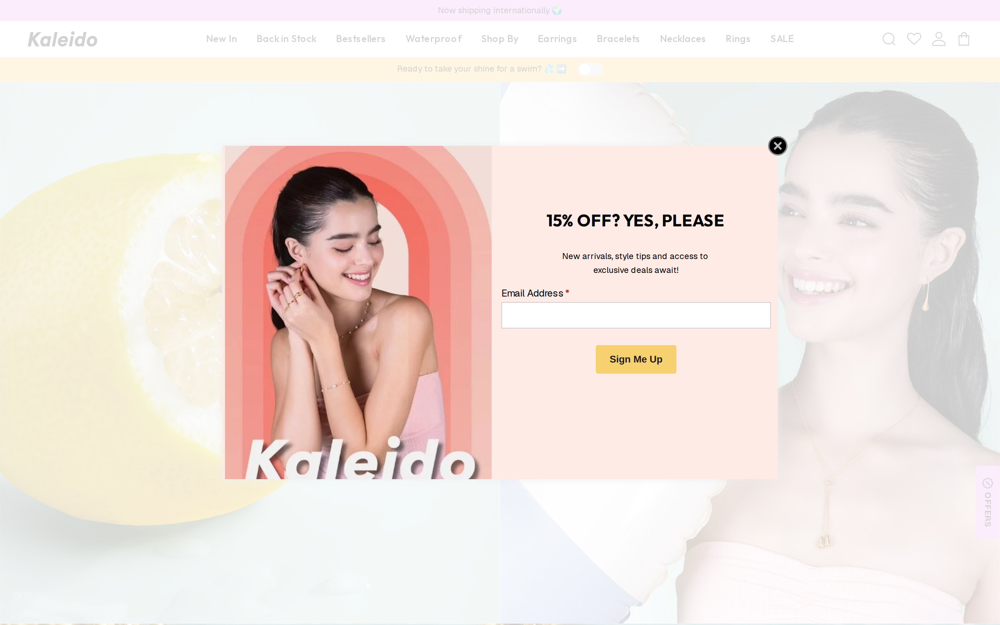
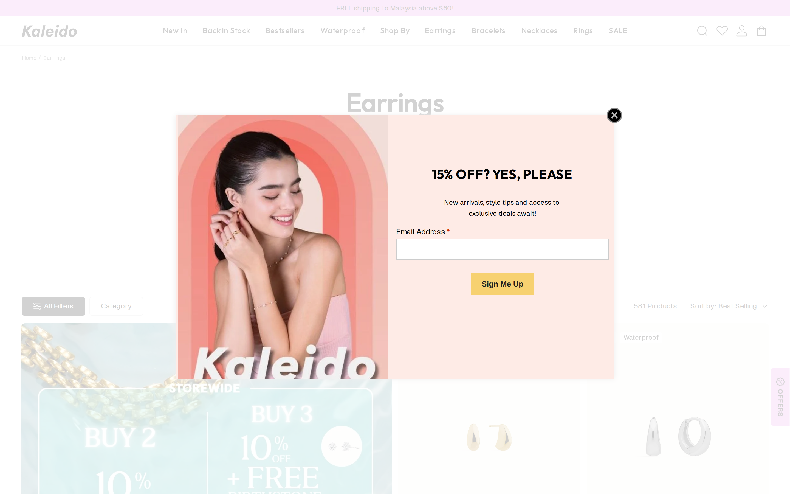
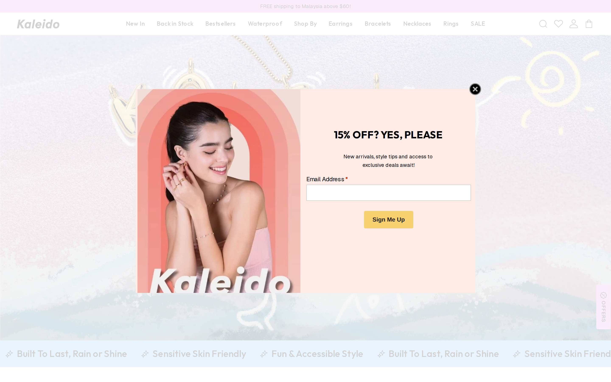
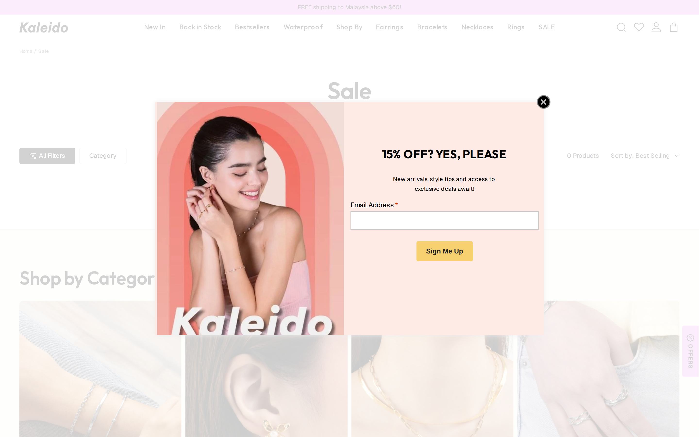

# Kaleido (kaleidojewellery.com) — Page Index

Screenshots live in [`../screenshots/kaleido/`](../screenshots/kaleido/).

---

## Home (`/`)

| # | Component | Screenshot ref | Key specs |
|---|---|---|---|
| 1 | **Lavender announcement bar** | `home/viewport-top.png` top | `#E8A5EA` bg, dark text, marquee scroll |
| 2 | Nav | full header | "Kaleido" wordmark left · category links center · search/wishlist/account/cart right |
| 3 | Yellow utility bar | below nav | `#F7D170` bg · "Ready to take your shine for a swim?" + toggle |
| 4 | **Split-panel hero** | `home/scroll-0.png` | 2 scenes side-by-side · oversized italic "Kaleido" wordmark at ~50% opacity across seam |
| 5 | **Category photo grid** | `home/scroll-900.png` | 6 equal columns · lifestyle on-model photos · **white label bottom-left** (14px Outfit 500) |
| 6 | **Editorial promo panel** | `home/scroll-900.png` | Full-bleed lifestyle bg · large heading · gold CTA button pinned bottom ("Shop All") |
| 7 | **OFFERS side tab** | right edge | Rotated vertical pill, `#E8A5EA` bg, fixed on scroll — **reference for "Ask Kira" tab** |
| 8 | Trust ticker | bottom of hero | "Built To Last, Rain or Shine ✦ Sensitive Skin Friendly ✦ …" scrolling |

**Measured typography** (`home/computed-styles.json`):
- Hero H1: Outfit 600, 120px, letter-spacing -1px (hidden behind popup on capture)
- Category labels H3: Outfit 500, 14px, letter-spacing 0.1px, white on photo

---

## Bestsellers (`/collections/best-sellers`) — **best reference for circles + product cards**

| # | Component | Screenshot ref | Key specs |
|---|---|---|---|
| 9 | Page header | centered | "Bestsellers" — Outfit 600, **48px**, letter-spacing -0.5px |
| 10 | **Circular sub-category nav** | below header | 4 circles: Bracelets/Earrings/Necklaces/Rings · **100×100px** · `#EEEEEE` bg · product silhouette inside · label below |
| 11 | **Filter bar** | above grid | "All Filters" black filled btn · "Category" outlined chip · "155 Products \| Sort by: Best Selling" right |
| 12 | **Product card** | grid | bg `#F9F8F4` · radius **8px** · **white rect tags** top-left ("Bestseller", "Waterproof") · swatch dots 28px · name + price |
| 13 | Promo tiles in grid | first slots | "BUY 2 10% OFF" / "BUY 3 10% OFF + FREE BIRTHSTONE" — mint bg editorial tiles |
| 14 | Lavender discount chip | on cards | `#E8A5EA` bg, "0% off" label |

**Measured from DOM** (`bestsellers/computed-styles.json`):
- Product card: 332×511px, bg `rgb(249,248,244)`, border-radius 8px
- "Bestseller" tag: white bg, 12px Geist, padding 1px 6px, border-radius 4px
- Grid gap: 20px
- "All Filters" button: bg `rgb(31,31,31)`, white text, padding 6px 20px, radius 4px

**Kira steal:** Circular nav (#10), product card warm bg (#12), filter bar (#11), OFFERS tab pattern from home (#7)

---

## Earrings (`/collections/earrings`)

Same layout as Bestsellers — category-specific heading, same filter bar + grid pattern.

---

## Product Detail (`/products/mini-huggie-hoop-earrings`)

| # | Component | Key specs |
|---|---|---|
| 15 | 2-col split images | Two product photos side-by-side, cream bg, vertical divider |
| 16 | Tag chips above image | "Bestseller" + "Waterproof" plain white rect tags |
| 17 | Breadcrumb | Home / Category / Product — top-right, small text |
| 18 | Finishing Colour swatches | 28×28px circles, silver/gold |
| 19 | Stone Size pills | Outlined chips: 1.5mm / 2mm / **3mm** (selected = dark border) |
| 20 | Length pills | 5.5" / 6.25" |
| 21 | **"Add to Bag — S$32.90"** | Full-width black btn · **price inside CTA text** · radius 4px · padding 14px 56px · 14px/500 |
| 22 | Wishlist heart | Right of CTA |
| 23 | STACK & SAVE upsell | "2 items = 10% off / 3 items & above = 10% off + Free Birthstone Earring" |
| 24 | Loyalty points row | "✦ Worth 165 points — Earn 5 points for every $1 spent" |
| 25 | Product promise | "🌿 Hypoallergenic jewellery, made for comfort." |
| 26 | "You May Also Like" rail | Horizontal product scroll below fold |
| 27 | Customer Reviews | Judge.me powered |

**Kira steal:** Price-in-CTA (#21) is the #1 pattern to copy for ProductCard + PDP

---

## Sale (`/collections/sale`)

Same grid/filter pattern as Bestsellers with sale-specific promo tiles and discount chips.
